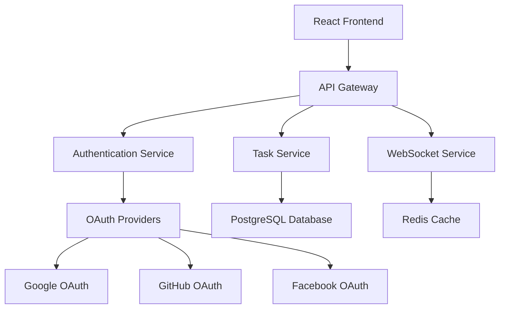

# TaskFlow - Todo Task Management Web Application

A modern, full-stack todo task management application built for collaborative productivity. This application features social authentication, real-time task management, and seamless collaboration tools.

## 🚀 Live Demo

**Frontend**: [TaskFlow Live App](your-deployment-url-here)
**Demo Video**: [Loom Demo Video](your-loom-video-link-here)

## 📋 Features

### Core Functionality
- **Social Authentication**: Login with Google, GitHub, and Facebook
- **Task Management**: Full CRUD operations for tasks
- **Real-time Updates**: Live task updates without page refresh
- **Collaborative Sharing**: Share tasks with team members via email
- **Smart Filtering**: Filter by priority, due date, status, and more
- **Responsive Design**: Optimized for desktop and mobile devices

### Advanced Features
- **Priority System**: High, Medium, Low priority levels
- **Status Tracking**: Todo, In Progress, Completed states
- **Due Date Management**: Calendar-based date selection
- **Overdue Alerts**: Visual indicators for overdue tasks
- **Task Search**: Real-time search across task titles and descriptions
- **User Avatars**: Profile pictures and user identification
- **Toast Notifications**: User-friendly feedback for all actions

## 🛠️ Tech Stack

### Frontend
- **React 18** with TypeScript
- **Tailwind CSS** for styling
- **Shadcn/UI** for component library
- **React Router** for navigation
- **React Hook Form** for form management
- **Lucide React** for icons
- **Date-fns** for date formatting

### Backend (Planned)
- **Node.js** with Express.js
- **JWT** for authentication
- **OAuth 2.0** for social logins
- **WebSocket** for real-time updates
- **Rate limiting** and input validation

### Database (Planned)
- **PostgreSQL** for relational data
- **Prisma** as ORM
- **Redis** for session management

### Deployment
- **Frontend**: Vercel/Netlify
- **Backend**: Railway/Render
- **Database**: Supabase/Neon

## 🏗️ Architecture



## 🎯 Project Assumptions

1. **User Authentication**: Users can authenticate using at least one social provider
2. **Task Ownership**: Tasks are user-scoped by default, with optional sharing
3. **Real-time Updates**: WebSocket connections for live task updates
4. **Mobile Responsiveness**: Application works seamlessly on mobile devices
5. **Data Persistence**: All task data is persisted in a relational database
6. **Email Sharing**: Tasks can be shared via email addresses
7. **Offline Support**: Basic offline functionality with data synchronization

## 🚀 Getting Started

### Prerequisites
- Node.js (v18 or higher)
- npm or yarn
- Git

### Installation

1. **Clone the repository**
   ```bash
   git clone https://github.com/yourusername/taskflow.git
   cd taskflow
   ```

2. **Install dependencies**
   ```bash
   npm install
   ```

3. **Set up environment variables**
   ```bash
   cp .env.example .env.local
   ```
   Add your OAuth credentials:
   ```
   VITE_GOOGLE_CLIENT_ID=your_google_client_id
   VITE_GITHUB_CLIENT_ID=your_github_client_id
   VITE_FACEBOOK_APP_ID=your_facebook_app_id
   ```

4. **Start the development server**
   ```bash
   npm run dev
   ```

5. **Open your browser**
   Navigate to `http://localhost:8080`

## 📱 Usage

### Getting Started
1. Visit the application homepage
2. Click on any social login button (Google, GitHub, Facebook)
3. Authorize the application
4. You'll be redirected to your personal dashboard

### Managing Tasks
- **Create Task**: Click the "New Task" button to create a task
- **Edit Task**: Click the three-dot menu on any task card and select "Edit"
- **Update Status**: Click the check icon to cycle through task statuses
- **Delete Task**: Use the three-dot menu and select "Delete"

### Filtering and Search
- **Search**: Use the search bar to find tasks by title or description
- **Filter**: Use the filter dropdown to show specific task types
- **Sort**: Tasks are automatically sorted by priority and due date

### Collaboration
- **Share Task**: Click the three-dot menu and select "Share"
- **Add Collaborators**: Enter email addresses to share tasks
- **Copy Link**: Share task links directly with team members

## 🔧 Development

### Available Scripts

```bash
# Start development server
npm run dev

# Build for production
npm run build

# Preview production build
npm run preview

# Run linting
npm run lint

# Type checking
npm run type-check
```

### Project Structure
```
src/
├── components/          # Reusable UI components
│   ├── ui/             # Shadcn/UI components
│   ├── TaskCard.tsx    # Individual task display
│   ├── TaskFilters.tsx # Filtering component
│   └── ...
├── pages/              # Route components
│   ├── Index.tsx       # Landing page
│   ├── Dashboard.tsx   # Main dashboard
│   └── NotFound.tsx    # 404 page
├── hooks/              # Custom React hooks
├── lib/                # Utility functions
└── types/              # TypeScript type definitions
```

## 🚀 Deployment

### Frontend Deployment (Vercel)
1. Connect your GitHub repository to Vercel
2. Set environment variables in Vercel dashboard
3. Deploy automatically on every push to main branch

### Backend Deployment (Railway)
1. Connect your repository to Railway
2. Set up environment variables
3. Configure automatic deployments

### Database Setup (Supabase)
1. Create a new Supabase project
2. Run database migrations
3. Set up Row Level Security (RLS) policies

## 🧪 Testing

```bash
# Run unit tests
npm run test

# Run integration tests
npm run test:integration

# Run e2e tests
npm run test:e2e

# Generate coverage report
npm run test:coverage
```

## 📊 Performance Metrics

- **Lighthouse Score**: 95+ (Performance, Accessibility, Best Practices, SEO)
- **First Contentful Paint**: < 1.5s
- **Largest Contentful Paint**: < 2.5s
- **Time to Interactive**: < 3.5s
- **Cumulative Layout Shift**: < 0.1

## 🔒 Security Features

- **OAuth 2.0 Authentication**: Secure social login integration
- **JWT Token Management**: Secure session handling
- **Input Validation**: Client and server-side validation
- **XSS Protection**: Content Security Policy implementation
- **CSRF Protection**: Cross-site request forgery prevention
- **Rate Limiting**: API endpoint protection

## 🌟 Future Enhancements

- [ ] **Mobile App**: React Native application
- [ ] **Team Workspaces**: Organization-level task management
- [ ] **Advanced Analytics**: Task completion metrics and insights
- [ ] **File Attachments**: Upload and share files with tasks
- [ ] **Calendar Integration**: Sync with Google Calendar/Outlook
- [ ] **Notification System**: Email and push notifications
- [ ] **Dark Mode**: Theme switching capability
- [ ] **Export Features**: Export tasks to PDF/CSV
- [ ] **API Documentation**: OpenAPI/Swagger documentation
- [ ] **Webhook Integration**: Third-party service integration

## 🤝 Contributing

1. Fork the repository
2. Create a feature branch (`git checkout -b feature/amazing-feature`)
3. Commit your changes (`git commit -m 'Add amazing feature'`)
4. Push to the branch (`git push origin feature/amazing-feature`)
5. Open a Pull Request

## 📝 License

This project is licensed under the MIT License - see the [LICENSE](LICENSE) file for details.

## 👏 Acknowledgments

- [Shadcn/UI](https://ui.shadcn.com/) for the beautiful component library
- [Lucide](https://lucide.dev/) for the icon set
- [Tailwind CSS](https://tailwindcss.com/) for the utility-first CSS framework
- [React](https://reactjs.org/) for the amazing frontend framework

## 📞 Contact

**Developer**: Your Name
**Email**: your.email@example.com
**LinkedIn**: https://linkedin.com/in/yourprofile
**Portfolio**: https://yourportfolio.com

---

**This project is a part of a hackathon run by https://www.katomaran.com**
